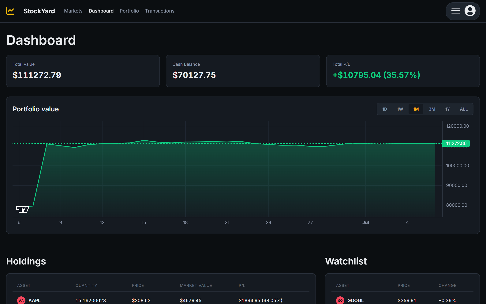
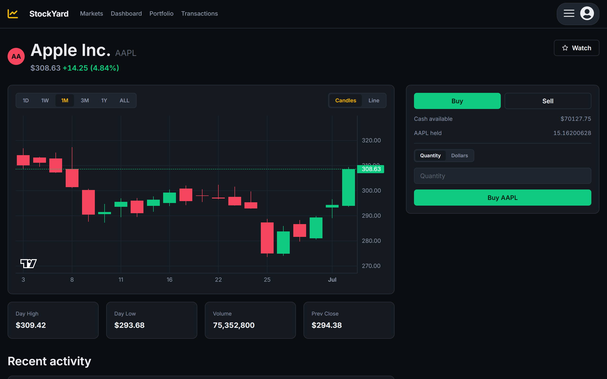

# StockYard

A full-stack paper-trading platform — think a mock Binance/Robinhood. Every
account starts with $100,000 in play money to trade 20 stocks and 8
cryptocurrencies against real market data, with live candlestick charts,
a portfolio equity curve, and a watchlist. No real money is ever involved.

**Live demo:** _add your Render URL here once deployed_
**Demo login:** `demo@aa.io` / `password` (or click "Log in as Demo" on the login page)

## Screenshots

<!--
  Add screenshots here once deployed — e.g.:
  
  
  
-->

## Features

- **Real market data** — live quotes and historical candles for 20 stocks and
  8 cryptocurrencies, sourced from Yahoo Finance via `yfinance`.
- **Always-on demo** — if live data is ever unavailable, a deterministic
  simulated market takes over automatically so the app never breaks. Every
  simulated quote/candle is tagged `source: "simulated"` in the API and shown
  with a badge in the UI.
- **Real trading logic** — buy/sell by quantity or dollar amount, weighted
  average cost basis, oversell/overbuy rejection, and a portfolio equity
  curve that replays your actual transaction history against historical
  prices.
- **Live charts** — candlestick and line views across 6 time ranges (1D
  through ALL), built on `lightweight-charts`.
- **Watchlist, transaction history with filters/pagination, and a portfolio
  allocation breakdown.**
- **Dark, Binance-inspired UI** with real crypto logos, generated stock
  monogram badges, and a responsive layout down to mobile.

## Tech stack

| Layer | Tech |
|---|---|
| Frontend | React 18, Vite, React Router 6, Redux 4 + Thunk, `lightweight-charts` |
| Backend | Flask 2.3, Flask-SQLAlchemy 3 (SQLAlchemy 1.4), Flask-Login, Flask-WTF (CSRF) |
| Data | PostgreSQL (production) / SQLite (development), Alembic migrations |
| Market data | `yfinance`, with an in-memory TTL cache and a deterministic simulated fallback |
| Deployment | Docker (multi-stage: Node build → Python runtime), Render |
| Testing | pytest |

## Architecture notes

**Market data service** (`app/services/market_data.py`) is the only module
that talks to `yfinance`. Every quote and chart request goes through one
TTL-cached batch fetch (60s for quotes, 2 minutes to 24 hours for history
depending on range), so the whole app — the markets table, the dashboard,
the ticker tape, portfolio pricing — shares a single set of API calls
instead of each widget hitting Yahoo independently.

If a request fails or Yahoo has no data, the service falls back to a
**deterministic simulated market**: a geometric random walk seeded by the
symbol, so the same symbol always produces the same historical price on the
same day (stocks only move on weekdays; crypto moves every day, mirroring
real market hours). This means the demo is never broken by a Yahoo outage or
rate limit, and the seeded Demo user's transaction history was itself
generated by replaying a scripted sequence of trades through this same
mechanism, so its cash balance and holdings are provably consistent.

**Portfolio history** (the equity curve on the dashboard) replays a user's
actual transactions day-by-day against cached historical closes, rather than
storing a separate time series — so it's always accurate to the real trade
log, at the cost of being the most complex piece in the codebase (see
`tests/test_portfolio_history.py`).

## API overview

All routes are prefixed `/api`. Trading/portfolio/watchlist/transaction
routes require an authenticated session; market data routes are public.

| Method | Route | Description |
|---|---|---|
| GET/POST | `/auth/`, `/auth/login`, `/auth/signup`, `/auth/logout` | Session auth |
| GET | `/market/assets` | The tradable symbol registry |
| GET | `/market/quotes?symbols=` | Cached live/simulated quotes |
| GET | `/market/history/<symbol>?range=` | OHLCV candles (`1D`/`1W`/`1M`/`3M`/`1Y`/`ALL`) |
| GET | `/market/search?q=` | Symbol/name search |
| GET | `/portfolio/` | Holdings, cash, and P/L |
| GET | `/portfolio/history?range=` | Equity curve |
| POST | `/orders/` | Place a buy/sell order (`{symbol, side, quantity}` or `{..., notional}`) |
| GET/POST/DELETE | `/watchlist/`, `/watchlist/<symbol>` | Watchlist CRUD |
| GET | `/transactions/?symbol=&side=&page=` | Paginated transaction history |

## Local setup

### Backend

```bash
py -3.12 -m venv .venv
.venv\Scripts\activate        # Windows; use `source .venv/bin/activate` on macOS/Linux
pip install -r requirements.txt

cp .env.example .env          # then fill in a real SECRET_KEY

flask db upgrade
flask seed all                # seeds 3 demo users, ~14 transactions, holdings, watchlist
flask run                     # http://localhost:8000
```

### Frontend

```bash
cd react-vite
npm install
npm run dev                   # http://localhost:5173, proxies /api to :8000
```

### Tests

```bash
pytest
```

## Deployment (Render)

The app builds as a multi-stage Docker image: a Node stage builds the React
frontend, and a Python stage serves both the API and the built frontend
through Flask/Gunicorn. Point a Render **Web Service** (Runtime: Docker) at
this repo.

Required environment variables:

| Variable | Notes |
|---|---|
| `SECRET_KEY` | Generate a random value |
| `DATABASE_URL` | Auto-populated if you attach a Render Postgres instance |
| `SCHEMA` | A unique schema name, snake_case (e.g. `stockyard_schema`) |
| `FLASK_APP` | `app` |

Leave `FLASK_DEBUG` unset in production — its absence is what the app uses to
detect it's running in production (enables the Postgres schema prefix and
secure cookie flags).

On container start, the app runs `flask db upgrade` (applies any pending
migrations) and `flask seed ensure` (seeds demo data **only if the database
is empty**) before starting Gunicorn — so redeploys and restarts never wipe
real signups or trades, but a fresh database still comes up with a working
Demo account.

**Use a real Postgres database, not SQLite**, for anything deployed — Render
web services have an ephemeral filesystem, so a SQLite file would be wiped on
every deploy.

## Project structure

```
app/                  Flask backend
  api/                 Route blueprints (auth, market, orders, portfolio, watchlist, transactions)
  services/            Business logic (market_data, orders, portfolio)
  models/              SQLAlchemy models (User, Holding, Transaction, WatchlistItem)
  assets.py            Curated stock/crypto registry (no Stock table — this is the source of truth)
  seeds/               Idempotent seed data for local dev / first deploy
migrations/            Alembic migrations
tests/                 pytest suite (order math, portfolio history replay)
react-vite/            React frontend
  src/pages/            Route-level pages
  src/components/       Shared components (charts, nav, trade panel, asset icons)
  src/redux/            Redux slices (session, market, portfolio, watchlist, transactions)
```
